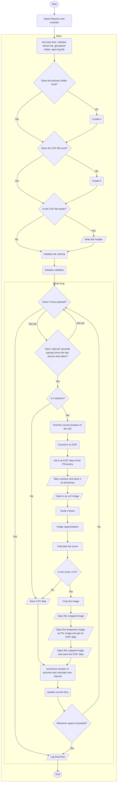
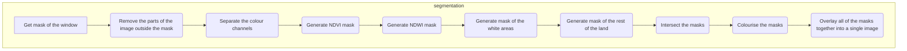
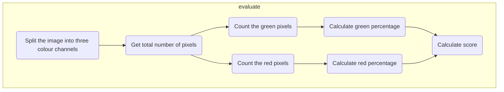
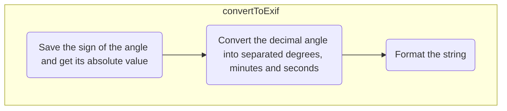
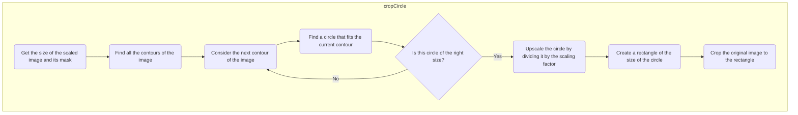
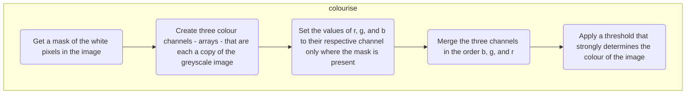
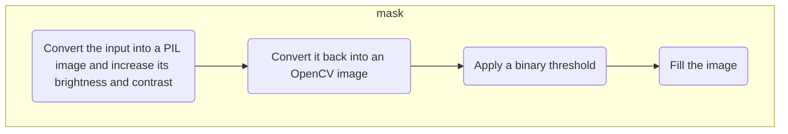
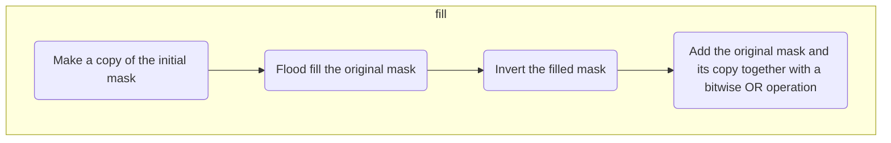
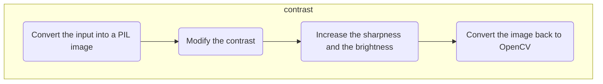
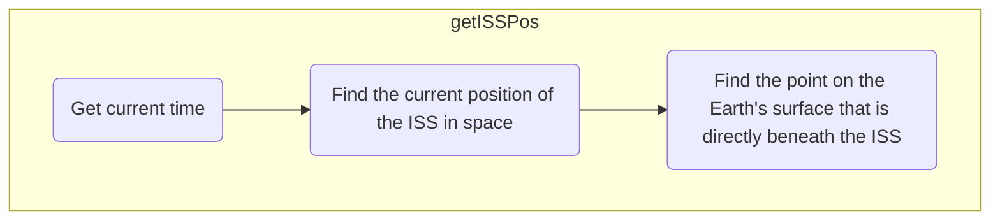

# Parsec-AstroPi
**2022-2023**  
Team name: Parsec  
School: *[Liceo Scientifico "Leonardo da Vinci", Gallarate (VA), IT](https://goo.gl/maps/iJFNK38aVivM7PgVA)*  
Mentor: Lucia Polidori  
Members: Daniele Nicolia, Davide Pascu, Matteo Saporiti, Leonardo Simonetti, Federico Sozzi, Jad Taljabini  
***
# Our project
## Abstract
Our project aims to determine whether and how much drainage **basins**, rivers, **lakes**, glaciers, and coasts have changed in the last decades due to **climate change**. The parameters we are going to focus on are the area covered by water, the shape of the water stream, and possibly, the amount of water provided to the surrounding land; this last aspect, which will be estimated considering vegetation health (that is an effect of the quantity of water received) will allow us to understand also how much water the stream supplies to the surrounding environment and consequently how the evolution of the water stream modifies the environment itself. The final destination of our research is to use the collected data to study possible links with climate change and **predict** how the observed sites will change in the future, considering possible effects on the landscape and the local population.

Our program makes use of computer vision techniques combined with **NDVI** and **NDWI** to recognise whether the ISS is passing over a relevant landscape and save as many useful images as possible during the three hours on the ISS.

## Future Plans for Phase 4
Our plan after Phase 3, **_assuming_** we get flight status, is to use the pictures that we collect on the ISS and the NIR satellite image datasets that can be found on the Internet to train a **machine learning model** capable of **predicting** the future water and vegetation **coverage** of a certain area, based on the past and current images of that area, taking into account seasonal variations and other factors.

# The software
The main function of our program is to take pictures of the Earth's surface as frequently as possible, only saving to memory the relevant ones. We have made extensive use of try-except statements to make sure that the program will not stop before it is needed, and we have implemented an intricate logging system that, in case anything goes wrong, will tell us the cause of the problem. We tried to follow good coding practices, writing the code as readable as possible, and especially ensuring to keep a certain level of optimisation and safety during runtime. The most significant features of our program are:
-   **NDVI** and **NDWI** calculation.
-   Algorithmic **image segmentation** to detect vegetation and land in the image and only save the pictures that contain land, excluding those that are all ocean or clouds. **_Note_**_: we initially wanted to use machine learning to perform image segmentation, we had also implemented a_ **_U-Net_** _convolutional neural network, but we did not find any datasets for the segmentation of NIR satellite images. To train it we would have had to make our own dataset of segmented images, which meant painting hundreds or_ **_thousands_** _of NIR satellite images by hand. We concluded that it would take us much less time to make an algorithm that does the same job, which is what we did, and it works just fine._
-   Image cropping to save storage.

## Structure
Our program is structured as follows:  
  
*Initialisation*
- Initialise the first objects and variables, such as the start time of the program, the *SenseHat*, get the path of the containing folder;
- Open the *log* file or create it if it does not exist;
- At the beginning of the main() function, the header of the *CSV* file is defined;
	> We will collect every parameter that the *SenseHat* is capable of, and the *CSV* header will be:  
	Date[DD/MM/YYYY],Time[UTC-24H],Altitude[m],Latitude[Deg],Longitude[Deg],Yaw[Deg],Pitch[Deg],Roll[Deg],xAcceleration[g],yAcceleration[g],zAcceleration[g],xMag[µT],yMag[µT],zMag[µT],xω[rad/s],yω[rad/s],zω[rad/s],Temperature[°C],Pressure[hPa],Humidity[%]
- The *CSV* file for saving the data collected by the *SenseHat* is opened or created if it does not exist;
- A folder to contain the pictures, `...\Pictures`, is created if it does not exist;
- The *CSV writer* and the *PiCamera* are initialised;
- Some variables that will be needed later are created;  

*Main loop*

- Start a *while* loop that cycles continuously for 2 hours and 59 minutes `now < (startTime + timedelta(hours = 2, minutes = 59))`;
	- By an if statement, enter the routine that will take a picture and save related data every 3 seconds or more, depending on how much free memory out of the 3GB is left and how much time remains. This time interval will be calculated at the end of the loop;
		- Check if the ISS is over a sunlit area (`ISS.at(load.timescale().now()).is_sunlit(ephemeris)`): if not, only data will be collected and no picture will be taken;
		- Set **EXIF** data of the next picture according to the current location of the ISS;
		- Take a picture with the *PiCamera*, saving it to a temporary path, overwriting the old one;
		- Open this picture as an *OpenCV* image and **scale** it down in order to make the following operations faster;
		- Use a computer vision algorithm that we have developed (which is implemented in the function `segmentation(image)` to get a **segmented** image from the picture that has just been taken;
		- This allows us to choose whether this picture should be permanently saved, by calculating a score that is based on the percentage of green and red pixels (respectively representing vegetation and generic landmass) in the segmented image;
			- If the score is high enough, the picture is **cropped** around the edge of the window of the ISS to save as much storage space as possible. This operation is performed by another *cv* algorithm - of which we are quite proud - that isolates the bright circle of the window, finds the border, and crops the image accordingly;
			- The cropped image is saved;
			- The EXIF data that was previously saved in the temporary image by *PiCamera* is copied to the newly saved final image, completing this long process of segmenting and cropping the picture;
			- Calculate a new time interval to wait before taking the next picture. This value is estimated by keeping track of the occupated storage space (in bytes) and the remaining time:
				> - The remaining space is the total allowed space minus the current space taken up by the '...\Pictures' folder:  
				$remainingspace = maxspace - currentspace = 2975000000 - picfoldersize$  
				> - The remaining time is the time the program is expected to end minus the current time:  
				$remainingtime = endtime - now = starttime + programtime - currenttime$  
				> - Given the space and the time, it is possible to estimate a maximum rate at which bytes can be added to the current space without exceeding the maximum space:  
				$v = \frac{s}{t} \implies rate = \frac{remainingspace}{remainingtime}$  
				> - The aforementioned rate has to be equal to the rate of the number of *n* pictures taken in the remaining time, seen as a sum of *n* intervals:  
				$remainingspace = n\cdot averagesize$; $remainingtime = n\cdot interval$  
				> - When these are substituded in:  
				$rate = \frac{remainingspace}{remainingtime} = \frac{n\cdot averagesize}{n\cdot interval}$ ; the *n* cancels out:  
				$\frac{remainingspace}{remainingtime} = \frac{averagesize}{interval} \implies interval = \frac{averagesize\cdot remainingtime}{remainingspace}$  
				> - The average size of a picture in bytes is calculated by dividing the total current size of the '...\Pictures' folder by the number of pictures:  
				$averagesize = \frac{picfoldersize}{picsnumber}$  
				$\implies interval = \frac{ \frac{picfoldersize}{picsnumber}\cdot remainingtime}{remainingspace} = \frac{picfoldersize\cdot remainingtime}{picsnumber \cdot remainingspace}$  
				Where $interval$, as previously indicated, is the amount of seconds to wait before taking the next picture in order to not exceed the $remainingspace$
		- The *Sense Hat* data is retrieved with `getData()` and saved to the *CSV* file;
	- The current time `now` is updated;
	- The total size of the picture folder is checked to make sure it does not exceed 2.75GB. If it does, the program is terminated;
- Close the camera, the *CSV* file and the *log* file.

**Flowchart**

***
## Functions
The most important functions are:
 - Image segmentation: *segmentation(im)*
 - Image evaluation: *evaluate(im)*
 - Conversion of an angle to EXIF: *convertToExif(angle)*
 - Appending a message to the log file: *log(msg)*
 - Cropping the picture to match the circular frame of the window: *cropCircle(scaledIm, im, scalingFactor)*
 - Turning a greyscale mask into a coloured three channel image: *colourise(im, r, g, b)*
 - Getting the mask of the window of the ISS: *mask(im)*
 - Filling masks: *fill(im)*
 - Changing the contrast of the image: *contrast(im, k)*
 - Getting the current location of the ISS: *getISSPos()*
 - Getting data from the *SenseHat*: *getData()*
 - Others: formatTime(), getDate(), getTime()
***
**Image segmentation**  
>*segmentation(im)*  
Paramaters:
> - *im*: OpenCV image
> 
> Returns: OpenCV image

Given an OpenCV image, this function uses a series of image manipulations to return another OpenCV image which is the segmented version of the one that is passed as a parameter. It uses NDVI and NDVI to better identify and distinguish the differences in colour inside the image. The segmentation colour classes are:  
- Green RGB(0, 255, 0) = vegetation
- Blue RGB(0, 0, 255) = water
- White RGB(255, 255, 255) = clouds and glaciers
- Red RGB(255, 0, 0) = anything else, mostly land without vegetation

|Original image|Segmented image|
|--|--|
| | |

***
**Image evaluation**  
>*evaluate(im)*  
Paramaters:
> - *im*: OpenCV image
> 
>Returns: float

Given an OpenCV image, this function finds the percentages of green and red pixels in the image, and returns a score based on the formula:  
$score = 10\cdot greenpercentage + redpercentage$

***
**Conversion of an angle to EXIF**  
>*convertToExif(angle)*  
Paramaters:
> - *angle*: float
> 
>Returns: (bool, string)

This function converts the decimal `angle` into an EXIF compatible string `"deg/1,min/1, sec/1000"` like in the case `12° 39' 12.365" -> "12/1,39/1,12365/1000"`.  
It returns `True` when the parameter was negative, otherwise `False` if positive, and the EXIF angle.

***
**Appending a message to the log file**  
>*log(msg)*  
Paramaters:
> - *msg*: string
> 
> Returns: void

Appends a new line to the *log* file `...\log.txt`, in the format `[dd/mm/yyyy,hh:mm:ss] msg`.

***
**Cropping the picture**  
>*cropCircle(scaledIm, im, scalingFactor)*  
Paramaters:
> - *scaled*: OpenCV image
> - *im*: OpenCV image
> - *scalingFactor*: float
> 
>Returns: OpenCV image

Uses the window mask of the image `scaledIm` to efficiently find a circle that fits the edge of the window, scales up this circle based on `scalingFactor` to adapt it to the unscaled picture, and returns the image `im` accordingly cropped.
|Scaled image|Original image|Mask with circle|Cropped image|
|--|--|--|--|
|||||

***
**Turning a greyscale mask into a coloured three channel image**  
>*colourise(im, r, g, b)*  
Paramaters:
> - *im*: greyscale OpenCV image
>  - *r*: int
>  - *g*: int
>  - *b*: int
> 
>Returns: BGR OpenCV image

This function converts an 8-bit image to a 24-bit image, while colouring the white pixels with the RGB value defined by the parameters _r_, _g_, and _b_.

|Greyscale|Mask
|--|--|
|||

***
**Getting the mask of the window of the ISS**  
>*mask(im)*  
Paramaters:
> - *im*: BGR OpenCV image
> 
>Returns: greyscale OpenCV image

Returns an 8-bit greyscale mask of the 24-bit BGR image that is passed as an argument. This mask represents the shape of the window of the ISS: it is white where light is coming in through the window and black everywhere else, where the darker edges of the window are.
This is obtained by drastically increasing the contrast of the input image to create a difference in brightness between the window and the rest, and then applying a binary threshold to extremise the colour. The mask is filled in order to remove any white spots outside of the main circle and black spots inside of it.

|Original image|Mask
|--|--|
|||

***
**Filling masks**  
>*fill(im)*  
Paramaters:
> - *im*: greyscale OpenCV image
> 
>Returns: greyscale OpenCV image

Given a window mask as the argument, this function flood fills the black area around the window and inverts the resulting image, in order to get a mask that has a full white circle where the window of the ISS is, and is completely black outside of this circle, without random white patches.

|Original image|Mask|Filled mask|
|--|--|--|
||||

***
**Changing the contrast of the image**  
>*contrast(im, k)*  
Paramaters:
> - *im*: BGR OpenCV image
> - *k* (= 75): int
> 
>Returns: BGR OpenCV image

This function takes in a 24-bit _OpenCV image_ and a number _k_, which is 75 by default, and applies a contrast modifier of intensity k on the image, together with a sharpness and brightness increase.

|Original image|Contrasted image|
|--|--|
|  ||

***
**Getting the current location of the ISS**  
>*getISSPos()*  
Returns: (float, float, float)

This function finds the geographic position of the ISS at the moment of execution and returns a tuple of three floats that contain the altitude in meters, the latitude, and the longitude in this order. The angles are expressed in decimal degrees.

***
**Getting data from the *SenseHat***  
>*getData()*  
Returns: list of strings

This function collects all the necessary data from the _SenseHat_ and returns it as a list of strings. When there is an error, the value that threw the exception is replaced with a hyphen.  
The order of the data corresponds to what is defined in the _CSV_ file header: 

    Date[DD/MM/YYYY],Time[UTC-24H],Altitude[m],Latitude[Deg],Longitude[Deg],Yaw[Deg],Pitch[Deg],Roll[Deg],xAcceleration[g],yAcceleration[g],zAcceleration[g],xMag[µT],yMag[µT],zMag[µT],xω[rad/s],yω[rad/s],zω[rad/s],Temperature[°C],Pressure[hPa],Humidity[%]
