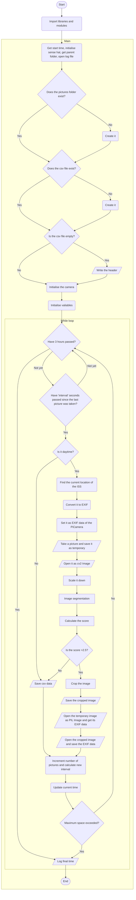
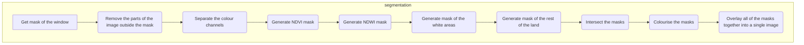
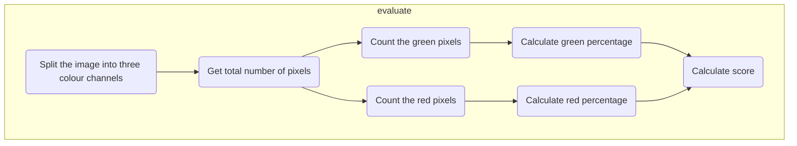

# Parsec-AstroPi
**2022-2023**
Team name: Parsec
School: *[Liceo Scientifico "Leonardo da Vinci", Gallarate (VA), IT](https://goo.gl/maps/iJFNK38aVivM7PgVA)*
Mentor: Lucia Polidori
Members: Daniele Nicolia, Davide Pascu, Matteo Saporiti, Leonardo Simonetti, Federico Sozzi, Jad Taljabini
***
# Our project
## Abstract
Our project aims to determine whether and how much drainage **basins**, rivers, **lakes**, glaciers, and coasts have changed in the last decades due to **climate change**. The parameters we are going to focus on are the area covered by water, the shape of the water stream, and the amount of water provided to the surrounding land: the latter will be estimated considering vegetation health (which depends on the quantity of water received) and will allow us to understand how much water the stream supplies to the surrounding environment and consequently how the evolution of the water stream modifies the environment itself. The final destination of our research is to use the collected data to study possible links with climate change and **predict** how the observed sites will change in the future, considering possible effects on the landscape and on the local population.

Our program makes use of computer vision techniques combined with **NDVI** and **NDWI** to collect as many useful images as possible during the three-hour period on the ISS.

## Future Plans for Phase 4
Our plan after Phase 3 (assuming we get flight status) is to use the pictures that we collect on the ISS and all of the satellite images 

# The software
The main function of our program is to take pictures of the Earth's surface as frequently as possible, only saving to memory the ones that are relevant. We have made extensive use of try-except statements to make sure that the program will not stop before it is needed, and we have implemented an intricated logging system that, in case anything goes wrong, will tell us the cause of the problem. We tried to follow a good coding practice, writing the code as readable as possible, and especially ensuring to keep a certain level of optimisation and safety during runtime.
The most significant features of our program are:
 - **NDVI** and **NDWI** calculation.
 - Algorithmic **image segmentation** to detect vegetation and land in the image and only save the pictures that contain land, excluding those that are all ocean or clouds. ***Note**: we initially wanted to use machine learning to perform image segmentation, we had also implemented a **U-Net** convolutional neural network, but in order to train it we would have had to make our own dataset of segmented images, which meant painting hundreds or **thousands** of NIR satellite images by hand. We figured it would take us much less time to make an algorithm that does the same job, which is what we did, and it works just fine.*
 - Image cropping to save storage.

## Structure
Our program is structured as follows:
- Initialise the first objects, such as the starting time of the program, the *SenseHat*; get the path of the containing folder;
- Open the *log* file or create it if it does not exist;
- The header of the *csv* file is defined at the beginning of the main function;
	> We will collect every parameter that the *SenseHat* is capable of, and the *csv* header will be:
	Date[DD/MM/YYYY],Time[UTC-24H],Altitude[m],Latitude[Deg],Longitude[Deg],Yaw[Deg],Pitch[Deg],Roll[Deg],xAcceleration[g],yAcceleration[g],zAcceleration[g],xMag[µT],yMag[µT],zMag[µT],xω[rad/s],yω[rad/s],zω[rad/s],Temperature[°C],Pressure[hPa],Humidity[%]
- The *csv* file for saving the data collected by the *SenseHat* is opened or created if it does not exist;
- A folder to contain the pictures, `...\Pictures`, is created if it does not exist;
- The *csv writer* and the *PiCamera* are initialised;
- Create some variables that will be needed later;
- Start a *while* loop that cycles continuously for 2 hours, 57 minutes and 30 seconds *(2:57:30)* `now < (startTime + timedelta(hours = 2, minutes = 57, seconds = 30))`;
	- Enter an if statement every 3 seconds or more, depending on how much free memory out of the 3GB is left and how much time remains. This time interval will be calculated at the end of the loop;
		- Check if the ISS is over a sunlit area (`ISS.at(load.timescale().now()).is_sunlit(ephemeris)`): if not, only data will be collected and no picture will be taken;
		- Set **EXIF** data of the next picture according to the current location of the ISS;
		- Take a picture with the *PiCamera*, saving it to a temporary path, overwriting the old one;
		- Open this picture as an *OpenCV* image and **scale** it down in order to make the following operations faster;
		- Use a computer vision algorithm that we have developed (which is implemented in the function `segmentation(image)` to get a **segmented** image from the picture that has just been taken;
		- This allows us to choose whether this picture should be permanently saved, by calculating a score that is based on the percentage of green and red pixels (respectively representing vegetation and generic landmass) in the segmented image;
			- If the score is high enough, the picture is **cropped** around the edge of the window of the ISS to save as much storage space as possible. This operation is performed by another *cv* algorithm - of which we are quite proud - that isolates the bright circle of the window, finds the border, and crops the image accordingly;
			- The cropped image is saved;
			- The EXIF data that was previously saved in the temporary image by *PiCamera* is copied to the newly saved final image, completing this long process of segmenting and cropping the picture;
			- Calculate a new time interval to wait before taking the next picture. This value is estimated by keeping track of the occupated storage space (in bytes) and the remaining time:
				> - The remaining space is the total allowed space minus the current space taken up by the '...\Pictures' folder:
				$remainingspace = maxspace - currentspace = 2975000000 - picfoldersize$
				> - The remaining time is the time the program is expected to end minus the current time:
				$remainingtime = endtime - now = starttime + programtime - currenttime$
				> - Given the space and the time, it is possible to estimate a maximum rate at which bytes can be added to the current space without exceeding the maximum space:
				$v = \frac{s}{t} \implies rate = \frac{remainingspace}{remainingtime}$
				> - The aforementioned rate has to be equal to the rate of the number of *n* pictures taken in the remaining time, seen as a sum of *n* intervals:
				$remainingspace = n\cdot averagesize$; $remainingtime = n\cdot interval$
				> - When these are substituded in:
				$rate = \frac{remainingspace}{remainingtime} = \frac{n\cdot averagesize}{n\cdot interval}$ ; the *n* cancels out:
				$\frac{remainingspace}{remainingtime} = \frac{averagesize}{interval} \implies interval = \frac{averagesize\cdot remainingtime}{remainingspace}$
				> - The average size of a picture in bytes is calculated by dividing the total current size of the '...\Pictures' folder by the number of pictures:
				$averagesize = \frac{picfoldersize}{picsnumber}$
				$\implies interval = \frac{ \frac{picfoldersize}{picsnumber}\cdot remainingtime}{remainingspace} = \frac{picfoldersize\cdot remainingtime}{picsnumber \cdot remainingspace}$
				Where $interval$, as previously indicated, is the amount of seconds to wait before taking the next picture in order to not exceed the $remainingspace$
		- The *Sense Hat* data is retrieved with `getData()` and saved to the *csv* file;
	- The current time `now` is updated;
	- The total size of the picture folder is checked to make sure it does not exceed 2.75GB. If it does, the program is terminated;
- Close the camera, the *csv* file and the *log* file.

**Flowchart**

***
## Functions
The most important functions are:
 - Image segmentation: *segmentation(im)*
 - Image evaluation: *evaluate(im)*
 - Conversion of an angle to EXIF: *convertToExif(angle)*
 - Appending a message to the log file: *log(msg)*
 - Cropping the picture to match the circular frame of the window: *cropCircle(scaledIm, im, scalingFactor)*
 - Turning a grayscale mask into a coloured three channel image: *colourise(im, r, g, b)*
 - Getting the mask of the window of the ISS: *mask(im)*
 - Filling in the holes inside a mask: *fill(im)*
 - Changing the contrast of the image: *contrast(im, k)*
 - Getting the current position of the ISS: *getISSPos()*
 - Getting data from the *SenseHat*: *getData()*
 - Others: formatTime(), getDate(), getTime(),
***
**Image segmentation**  
>*segmentation(im)*  
Paramaters:
> - *im*: OpenCV image
> - *return*: OpenCV image

Given an OpenCV image, this function uses a series of image manipulations to return another OpenCV image that is the segmented version of the one that is passed as parameter. It uses NDVI and NDVI to better identify and distinguish the differences in colour inside the image. The segmentation colour classes are:
- Green RGB(0, 255, 0) = vegetation
- Blue RGB(0, 0, 255) = water
- White RGB(255, 255, 255) = clouds and glaciers
- Red RGB(255, 0, 0) = anything else, mostly land without vegetation

|Original image|Segmented image|
|--|--|
| | |

***
**Image evaluation**  
>*evaluate(im)*  
Paramaters:
> - *im*: OpenCV image
> - *return*: float

Given an OpenCV image, this function finds the percentages of green and red pixels in the image, and returns a score based on the formula:
$score = 10\cdot greenpercentage + redpercentage$

***
**Image evaluation**  
>*evaluate(im)*  
Paramaters:
> - *im*: OpenCV image
> - *return*: float

Given an OpenCV image, this function finds the percentages of green and red pixels in the image, and returns a score based on the formula:
$score = 10\cdot greenpercentage + redpercentage$

